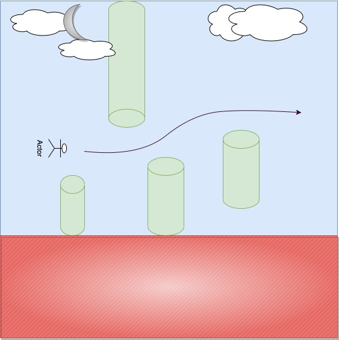

# Jumpy
This game I created is basically a Flappy Bird game, but I have added a point system where you can keep record of how far stay alive for. It's a game where you play as a bird and try to stay alive by avoiding touching pipes that move toward you, all while also not touching the ground. Otherwise, it will be game over.

To get the game visit: https://raylee45.github.io/Jumpy/

## Requirements
The requirements needed for this project to be successful:
- A design to show winner/loser.
- Display the game in the browser.
- Include separate HTML / CSS / JavaScript files
- Stick with KISS (Keep It Simple Stupid) and DRY 
    (Don't Repeat Yourself) principles
- Use Javascript for DOM manipulation
- Deploy your game online, where the rest of the world 
    can access it
- Use semantic markup for HTML and CSS

## How the game works:
1. Use spacebar to make your character jump as it fights against gravity and avoid touching the pipes and ground.
2. There will be top and bottom pipes/obstacles that move towards the bird horizontally-left. As the bird, you will have to try your best to stay in between the gap of the 2 pipes/obstacles AND avoid touching the ground to avoid making it game over.
3. Each time the bird jumps, the player will receive 10 points. Get to highest score possible and/or once a certain score is reached you will be announced a winner (for class demonstration purposes).

## Techniques used:
- For the game's framework, I stuck with utilized only JavaScript instead of Canvas. 
- Created different functions for obstacle movement, bird movements and collision detections.

## Wireframe:
This is a wireframe I built my game around while brainstorming the game-making process.

## App Screenshot:

Finished!